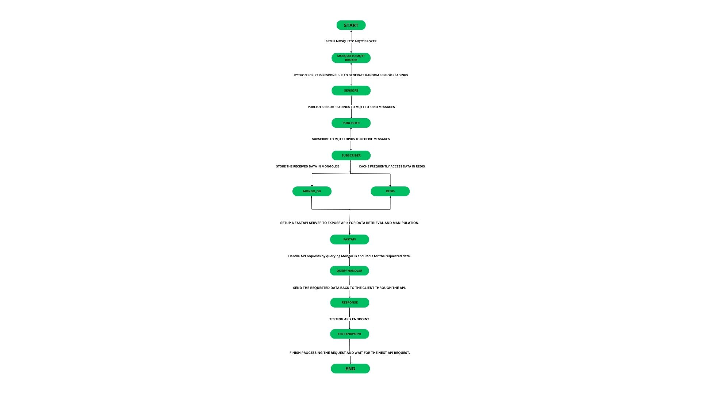

## * Table of Contents

1. [Project Title and Description]()
2. [Features]()
3. [Instructions for setting up and interacting with the system using the docker-compose command]()

4. [A detailed overview of each service is in the docker-compose.yml file]()

    a. eclipse_mosquitto service
   
    b. mqtt-publisher service
   
    c. mqtt-subscriber service
   
    d. mongo_db service
   
    e. redis_db service
   
    f. fastapi-app service
   
    g. test_api service
   

6. [API Reference]()
7. [Insight into the design choices you made and the rationale behind them]()
8. [If you happen to encounter any ambiguities, please make informed assumptions and document them]()
9. [Challenges Faced]()
10. [Troubleshooting for Common Problems]()


## * Mosquitto_MQTT with MongoDB, Redis and FASTAPI

## REQUIREMENTS FLOW CHART

This flowchart outlines the basic steps involved in a project that combines these technologies.

## * Project Description

The project involves building a real-time messaging system using Mosquitto MQTT as the message broker. MQTT allows for lightweight and efficient communication between devices and applications.

To store and manage the received messages, MongoDB is used as the database. MongoDB is a NoSQL document database that provides flexibility and scalability for handling large amounts of data.

Redis, an in-memory data structure store, is used for caching and pub/sub functionality. It helps improve the performance of the messaging system by storing frequently accessed data in memory.

FASTAPI, a modern, fast (high-performance), web framework for building APIs with Python 3.7+ based on standard Python type hints, is used to develop the backend API. FASTAPI provides easy integration with MongoDB, Redis, and MQTT libraries, making it a suitable choice for this project.

By combining these technologies, I have create a robust and scalable messaging system that can handle real-time communication between devices or applications.
## * Features

The combination of Mosquitto MQTT, MongoDB, Redis, and FASTAPI in a Python project offers several powerful features:

### 1. Real-time messaging :-
 Mosquitto MQTT allows for efficient and lightweight communication between devices and applications, enabling real-time messaging capabilities.

### 2. Scalability and flexibility :-
MongoDB, a NoSQL document database, provides scalability and flexibility in handling large amounts of data. It allows for easy storage and retrieval of MQTT messages.

### 3. Caching and pub/sub functionality :-
 Redis, an in-memory data structure store, enhances performance by caching frequently accessed data. It also provides pub/sub functionality, allowing for efficient message distribution.

### 4. High-performance API development :- 
FASTAPI, a modern web framework, offers high-performance API development capabilities. It integrates seamlessly with MongoDB, Redis, and MQTT libraries, simplifying the development process.

### 5. Easy integration :-
 These technologies can be easily integrated, allowing for seamless communication between MQTT, MongoDB, Redis, and FASTAPI components.

### 6. Scalable and robust architecture :-
 The combination of these technologies enables the creation of a scalable and robust architecture, capable of handling large volumes of real-time messages.

By leveraging these features, you can build a powerful messaging system that supports real-time communication, handles large data volumes, and ensures high performance.


## * Instructions for setting up and interacting with the system using the docker-compose command

To set up and interact with the system using the `docker-compose` command, follow these steps:

1. In this Project i have used the open-source message broker Eclipse Mosquitto which implements MQTT version 5, 3.1.1, and 3.

    Mosquitto MQTT broker is available for Windows 10 and 11, Linux, and macOS.

For the installation process, I have used the official eclipse-mosquitto image.

The process of installing and configuring the Mosquitto Docker container is practically the same for different operating systems. Prerequisites: you must have Docker installed (Windows users have to install Docker Desktop).

2. Clone the repository or download the project files or create the workspace to your local machine.

3. Navigate to the project directory or workspace in your terminal or command prompt.

4. Run the command `docker-compose up` to start the system.

5. Wait for the services to be built and started. You should see logs indicating the progress.

6. Once the system is up and running, you can interact with it using the specified endpoints or ports.

7. To stop the system, use the command `docker-compose down`. This will stop and remove the containers.

## * A detailed overview of each service is in the docker-compose.yml file.

### 1.  eclipse_mosquitto service :-
The `eclipse-mosquitto` service is a popular open-source MQTT broker that allows devices and applications to communicate using the MQTT protocol. MQTT is a lightweight messaging protocol designed for efficient and reliable communication in IoT (Internet of Things) and other resource-constrained environments.

With the `eclipse-mosquitto` service, you can set up a MQTT broker that enables devices to publish messages (also known as "publishers") and subscribe to topics to receive messages (also known as "subscribers"). It provides a flexible and scalable solution for building IoT systems and applications.

In the context of Python, you can use the `paho-mqtt` library to connect to the `eclipse-mosquitto` broker and interact with MQTT messages in your Python code. This allows you to build powerful and real-time communication between devices and applications.

### 2.  mqtt-publisher service :-
The publisher service in `eclipse-mosquitto` refers to the functionality that allows devices or applications to publish messages to the MQTT broker. In other words, the publisher is responsible for sending data or information to the broker, which can then be received by subscribers.

To use the publisher service in `eclipse-mosquitto`, you can utilize MQTT client libraries such as `paho-mqtt` in Python. These libraries provide a convenient way to establish a connection to the broker and publish messages.

In Python, you can create a publisher by initializing an MQTT client and connecting it to the `eclipse-mosquitto` broker using the appropriate host, port, and credentials. Once connected, you can use the `publish()` method to send messages with a specified topic and payload.

For example, in Python code, you can create a publisher like this:

```python
import paho.mqtt.client as mqtt

# Create an MQTT client
client = mqtt.Client()

# Connect to the MQTT broker
client.connect("localhost", 1883)

# Publish a message
client.publish("Sensor/Temperature", "Message")

# Disconnect from the broker
client.disconnect()
```

By running this code, the publisher will send the message "Message" to the topic "Sensor/Temperature" on the `eclipse-mosquitto` broker.

Remember to handle any necessary error checking and ensure that your publisher is properly configured to connect to the correct broker.


### 3.  mqtt-subscriber service :-
The subscriber service in `eclipse-mosquitto` allows devices or applications to receive messages from the MQTT broker. Subscribers subscribe to specific topics and receive any messages published to those topics.

To use the subscriber service in `eclipse-mosquitto`, you can utilize MQTT client libraries such as `paho-mqtt` in Python. These libraries provide a convenient way to establish a connection to the broker and subscribe to topics.

In Python, you can create a subscriber by initializing an MQTT client and connecting it to the `eclipse-mosquitto` broker using the appropriate host, port, and credentials. Once connected, you can use the `subscribe()` method to subscribe to specific topics.

For example, in Python code, you can create a subscriber like this:

```python
import paho.mqtt.client as mqtt

# Create an MQTT client
client = mqtt.Client()

# Define a callback function to handle received messages
def on_message(client, userdata, message):
    print("Received message:", message.payload.decode())

# Set the callback function for received messages
client.on_message = on_message

# Connect to the MQTT broker
client.connect("localhost", 1883)

# Subscribe to a topic
client.subscribe("Sensor/Temperature")

# Start the MQTT client loop to process incoming messages
client.loop_start()
```

By running this code, the subscriber will connect to the `eclipse-mosquitto` broker, subscribe to the topic "Sensor/Temperature", and start processing incoming messages using the defined callback function.

Remember to handle any necessary error checking and ensure that your subscriber is properly configured to connect to the correct broker.

### 4.  mongo_db service :-
MongoDB is a popular NoSQL database that provides a flexible and scalable solution for storing and managing data. It uses a document-based model, where data is stored in flexible, JSON-like documents called BSON.  

This service is used to store the incoming messages from publisher as documents in collections. Each document can represent a single message and contain relevant fields such as -  
```{ "sensor_id": "unique_sensor_id", "value": "<reading_value>", "timestamp": "ISO8601_formatted_date_time" }```.

In Python, you can interact with MongoDB using the official MongoDB Python driver called "PyMongo". PyMongo provides a simple and intuitive API for connecting to a MongoDB server, performing CRUD operations, and working with collections and documents.

To get started, you'll need to install PyMongo by running the following command:

```python
pip install pymongo
```

Once installed, you can establish a connection to your MongoDB server using the `MongoClient` class:

```python
from pymongo import MongoClient

# Connect to the MongoDB server
client = MongoClient("mongodb://localhost:27017")
```

From there, you can access databases and collections and perform various operations. Here's an example of inserting a document into a collection:

```python
# Access a specific database
db = client["mydatabase"]

# Access a collection within the database
collection = db["mycollection"]

# Insert a document into the collection
document = { "sensor_id": "unique_sensor_id", "value": "<reading_value>", "timestamp": "ISO8601_formatted_date_time" }
result = collection.insert_one(document)
```

You can also query documents, update them, and delete them using PyMongo. Here's an example of finding documents that match a specific criteria:

```python
# Find All documents in the collection
results = collection.find()

# Iterate over the results
for document in results:
    print(document)
```

### 6.  redis_db service :-
Redis is an open-source, in-memory data structure store that can be used as a database, cache, and message broker. It provides high-performance and low-latency access to data, making it popular for use cases that require fast data retrieval.

In Python, you can use the `redis` library to interact with Redis. It provides a simple and intuitive API for working with Redis commands. To start using Redis in Python, you'll need to install the `redis` library using `pip`.

Once installed, you can establish a connection to the Redis server using the `redis.Redis` class. You can then use various methods provided by the library to interact with Redis, such as `set`, `get`, `incr`, `decr`, etc.

For example, here's a simple Python code snippet that demonstrates how to use Redis to store and retrieve data:

```python
import redis

# Create a Redis client
client = redis.Redis(host='localhost', port=6379)

# Set a key-value pair
client.set('mykey', 'myvalue')

# Get the value for a key
value = client.get('mykey')
print(value.decode())  # Output: 'myvalue'
```

In this example, we create a Redis client, set a key-value pair ('mykey' and 'myvalue'), and then retrieve the value for the key 'mykey'.

Redis also provides additional features like pub/sub messaging, where clients can publish messages to channels and subscribe to receive messages from those channels. This can be useful for building real-time applications or implementing messaging systems.

### 6.  fastapi-app service :-
FastAPI is a modern, fast (high-performance), web framework for building APIs with Python. It is designed to be easy to use, highly efficient and documentation of the API endpoints.

FastAPI is built on top of Starlette, a high-performance asynchronous web framework, and Pydantic, a data validation and serialization library. It leverages the power of asynchronous programming to handle high-concurrency workloads efficiently.

With FastAPI, you can define API routes using Python functions and take advantage of type hints to automatically validate request and response data. FastAPI also generates interactive API documentation automatically, making it easy to understand and test your API endpoints.

Here's a simple example of defining an API endpoint using FastAPI:

```python
from fastapi import FastAPI

app = FastAPI()

@app.get("/hello/{name}")
async def hello(name: str):
    return {"message": f"Hello, {name}!"}
```

In this example, we define a GET endpoint at the path "/hello/{name}". The "{name}" part is a path parameter that will be passed as an argument to the `hello` function. The type hint `str` ensures that the value passed for the `name` parameter is a string. The function returns a JSON response with a greeting message that includes the provided name.

FastAPI also supports various features such as query parameters, request bodies, path operations, dependency injection, authentication, and more. It integrates well with other Python libraries and frameworks, making it a versatile choice for building APIs.

To run a FastAPI application, you can use a web server like uvicorn. These server provide high-performance HTTP handling and support running FastAPI applications in production.

### 6.  test_api service :-

Pytest is a popular testing framework for Python. It provides a simple and efficient way to write tests. You can use it to write test cases, assertions, and fixtures for your Python code. It's easy to get started with pytest by installing it using pip and writing your test functions with the appropriate naming conventions. Folder Name, Module Name, and Function should starts with test.

1. Import the necessary libraries:

```
python
import pytest
from fastapi.testclient import TestClient
from main import app
```

2. Create a test client using `TestClient`:

```
python
client = TestClient(app)
```

3. Write test functions :

```
def test_readings_range():
    response = client.get(
        "/readings?Sensor_Name=temperature&Start_Range=10&End_Range=30")
    assert response.status_code == 200
    assert response.json() != ''
```

In this implementation, the `test_readings_range and test_latest_10_readings` functions sends a GET request to the FastAPI endpoint with parameters and asserts that the response status code is 200 and asserts that the returned response is not empty.

## * API Reference

### 1. To fetch sensor readings by specifying a start and end range.

```http
  GET http://localhost/readings?Sensor_Name=temperature&Start_Range=10&End_Range=30
```

| Parameter | Type     
| :-------- | :------- | 
| `Sensor_Name` | `string` 
| `Start_Range` | `integer`
| `End_Range` | `integer`


### 2. To retrieve the last ten sensor readings for a specific sensor.

```http
  GET http://localhost/Last_10_readings?Sensor_Name=humidity
```

| Parameter | Type    
| :-------- | :------- | 
| `Sensor_Name`      | `string` 


## * Insight into the design choices you made and the rationale behind them.

To build the Eclipse Mosquitto broker with MongoDB, Redis, and FastAPI, I made the following design choices:

### 1. Eclipse Mosquitto :-
 I chose Eclipse Mosquitto as the MQTT broker because it is a widely used and highly reliable open-source MQTT broker. It provides support for the MQTT protocol, allowing devices to publish and subscribe to messages, making it suitable for building scalable IoT applications.

### 2. MongoDB :-
 I integrated MongoDB as the database because it is a flexible and scalable NoSQL database. It allows for storing and retrieving MQTT messages efficiently, providing a reliable and persistent storage solution. MongoDB's document-based model also allows for easy querying and manipulation of data.

### 3. Redis :-
 I included Redis as a caching and pub/sub system. Redis is an in-memory data structure store that can be used for caching frequently accessed data, improving performance. It also provides a pub/sub system, allowing for real-time communication between different components of the application.

### 4. FastAPI :-
I chose FastAPI as the web framework for building the API layer because it is a modern, high-performance framework that integrates well with asynchronous programming. FastAPI's automatic validation and documentation features make it easy to build and test API endpoints. Its integration with Starlette allows for efficient handling of high-concurrency workloads.

The rationale behind these choices is to create a robust and scalable system for handling MQTT messages. By using Eclipse Mosquitto as the MQTT broker, MongoDB for persistent storage, Redis for caching and pub/sub capabilities, and FastAPI for building the API layer, we can achieve a reliable and high-performance system for IoT applications.

I hope this provides insight into the design choices made for building the Eclipse Mosquitto broker with MongoDB, Redis, and FastAPI.
## * Challenges


During the development of Eclipse Mosquitto with MongoDB, Redis, and FastAPI, I encountered a few challenges and implemented the following solutions:

### 1. Integration Complexity :-
 Integrating multiple technologies like Eclipse Mosquitto, MongoDB, Redis, and FastAPI can be complex. To overcome this, I followed a modular approach, breaking down the development into smaller tasks and focusing on one technology at a time. This allowed me to ensure seamless integration between the components.

### 2. Scalability and Performance :-
 As the system handles a large number of MQTT messages, ensuring scalability and performance was crucial. I have used the MongoDB for quering the collection to improve query performance. Additionally, I leveraged Redis caching to reduce the load on the database and improve response times.

### 3. Real-time Communication :-
 Implementing real-time communication between components using Redis pub/sub and MongoDB required careful consideration. I have designed a pub/sub architecture and Singlton design pattern for MongoDB and Redis, So that only one instance should be shared in entire application where MQTT messages were published to specific channels, and other components subscribed to those channels to receive real-time updates. This allowed for efficient and reliable communication between different parts of the system.


By addressing these challenges and implementing the solutions mentioned above, I was able to develop a robust and scalable system for Eclipse Mosquitto with MongoDB, Redis, and FastAPI.
## * Troubleshooting

During the installation and configuration of the broker i have faced some errors.

### 1. Address not available -
After installing the Mosquitto MQTT docker image and starting the container, an error “Address not available” error may occur.

### Possible solutions:

1. If you want to allow clients to connect to the broker without authorization, add the following settings to the configuration file:

```
allow_anonymous true
listener 1883
```

2. If you want to prevent unauthorized clients from connecting to the broker, then create a file that will contain the username and password and add the following lines to the configuration file:

```
password_file /mosquitto/passwd_file
allow_anonymous false
```

3. After that, restart the Docker container.


### 2. Address already in use -
This error may mean that the specified port is already taken or that Mosquitto is already running.

### Possible solutions:

1. Try uninstalling all previously running versions of Mosquitto.
2. Use a different port for the broker.


### 3. Volumes don’t work for Windows -
Basically on windows users can experience problems with docker volumes. Volumes might not mount at all. 

### Possible solutions:

1. Use cmd or PowerShell, and make sure that the paths are correct and are defined in the windows format.
2. Make sure that you have shared drives enabled in your docker desktop settings (however, this setting might not be available in all the docker desktop installations).
3. You can try installing docker directly onto the WSL without Docker Desktop and using it from the WSL (though this approach is more complicated).


